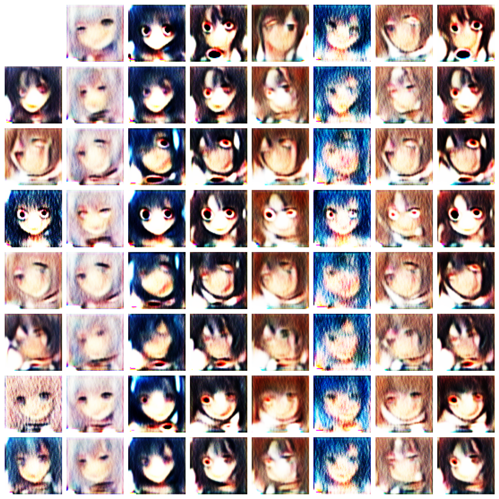
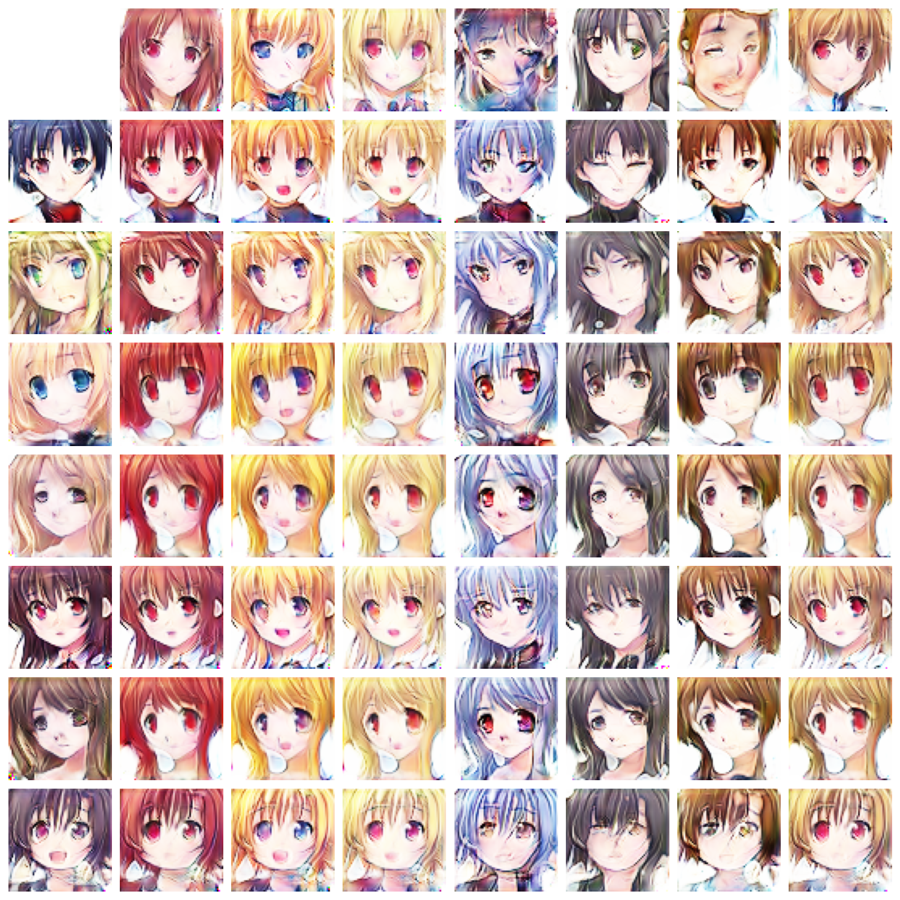
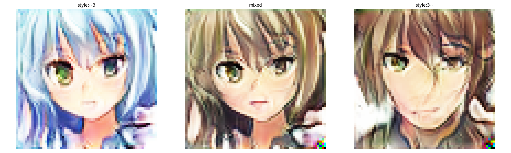

An implementation of StyleGAN on Animation dataset.

## Install 

```shell script
git clone https://github.com/MorvanZhou/anime-StyleGAN
cd anime-StyleGAN
pip install -r requirements.txt
```

## Process data
Download data from kaggle [Anime Faces](https://www.kaggle.com/soumikrakshit/anime-faces) (~400MB), 
then unzip \*.zip to the anime/images folder.

process data to tensorflow tensor_record format.

```shell script
python dataset.py --data_dir ~/data/anime/
```

## Train

```shell script
python train.py --data_dir ~/data/anime/ --soft_gpu -b 32 --latent 128 --epoch 151 -lr 0.0005 -b1 0. -b2 0.99 -w 2
```

## Results

First few of epoch:



After one day:



## Style mixing

```shell script
python restore.py --model_path visual/2021-01-14_19-39-20/model/cp-0137.ckpt -o demo/stylemix.png -n 3 --z_seed 2 --n_seed 1 --latent 128
```


